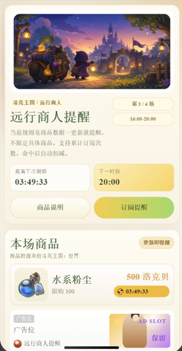
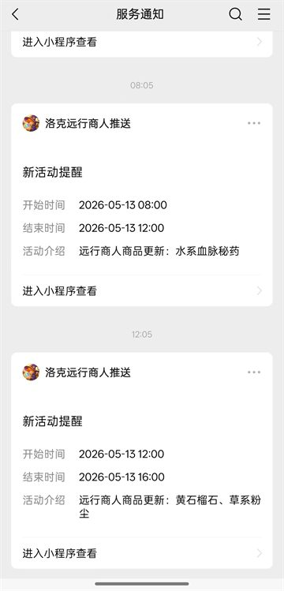

# 洛克王国远行商人提醒

一个用微信小程序和云开发做的远行商人提醒工具。

小程序会展示当前时间段的远行商人商品，并在商品数据更新时通过微信订阅消息提醒用户。订阅消息按微信规则计次：用户每授权一次，就增加一次可推送机会；后台成功发送一次提醒后，自动扣减一次。

<p>
  
  
</p>

## 功能

- 展示当前时段的远行商人商品、价格、限购信息和剩余时间
- 商品数量动态渲染，不写死固定数量
- 商品图片由云函数抓取并转成小程序可展示的数据
- 商品数据暂时来自 onebiji 的远行商人页面
- 商品数据更新后触发订阅消息提醒
- 支持订阅次数累计和推送后自动扣减
- 首页保留广告位，方便后续接入变现

## 时间段

远行商人按 4 个时间段展示：

- `08:00-12:00`
- `12:00-16:00`
- `16:00-20:00`
- `20:00-24:00`

后台定时任务会定期同步当前商品快照；如果某个时间段刚开始时页面暂时没有商品，小程序会显示“数据更新中”。

## 技术栈

- 微信小程序原生开发
- 微信云开发 CloudBase
- 云函数定时任务
- 微信订阅消息 HTTP API
- 云数据库记录订阅次数和商品快照

## 目录

```text
.
├── app.js
├── app.json
├── app.wxss
├── pages/
│   ├── index/       # 首页、商品展示、订阅入口
│   └── settings/    # 本地设置页
├── utils/
│   └── merchant.js  # 时间段、配置和页面解析工具
└── cloudfunctions/
    ├── createMerchantSubscription/
    ├── getMerchantSnapshot/
    ├── getMerchantSubscriptionStatus/
    ├── sendMerchantNotifications/
    └── syncMerchantSnapshot/
```

## 云函数

`createMerchantSubscription`

用户允许订阅消息后，写入或更新订阅记录，并将 `remainingCount` 加 1。

`getMerchantSubscriptionStatus`

查询当前用户还剩多少次提醒机会。

`syncMerchantSnapshot`

抓取当前时间段的远行商人商品，并写入 `merchant_snapshots`。

`sendMerchantNotifications`

定时检查最新商品快照。发现新快照后，给仍有订阅次数的用户发送订阅消息，并扣减 `remainingCount`。

## 数据库集合

- `merchant_subscriptions`：用户订阅记录、剩余次数、最近推送快照
- `merchant_snapshots`：最近抓取到的商品快照
- `merchant_runtime_config`：缓存微信 `access_token`

## 本地开发

1. 使用微信开发者工具导入项目目录
2. 将 `project.config.json` 中的 AppID 改成自己的小程序 AppID
3. 开通微信云开发，并把代码里的云环境 ID 替换成自己的环境
4. 创建所需数据库集合，并部署 `cloudfunctions/` 下的云函数
5. 在云函数 `sendMerchantNotifications` 中配置订阅消息所需的环境变量
6. 编译运行小程序

需要配置的环境变量：

```text
APPID=你的小程序 AppID
APPSECRET=你的小程序 AppSecret
MINIPROGRAM_STATE=developer
```

`APPSECRET` 只放在云函数环境变量里，不要提交到代码仓库。

如果要在小程序端直接请求外部页面，需要在小程序后台配置 request 合法域名。当前主要抓取逻辑已经放在云函数侧，前端优先读取云端快照。

## 免责声明

本项目仅供学习交流使用，数据来源于第三方社区。接口稳定性不作保证，请勿商用。
